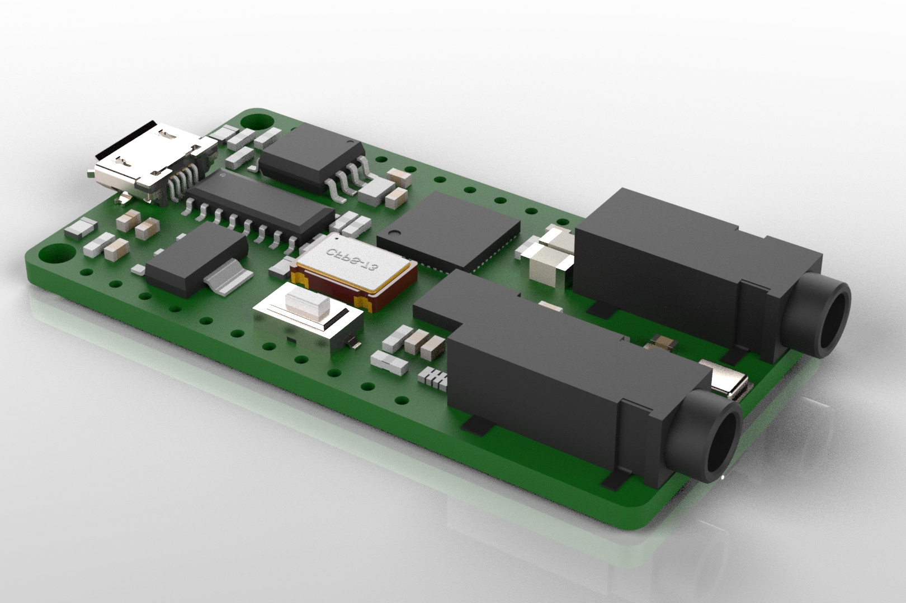

# NodeFPGA :sound::rocket:
Why buy a iCE40UP5k breakout when it is possible to make one?

  

## What is  this?
This aims to be another FPGA breakout board. What makes this board special is the
usage of a cheap CH551 microcontroller as the bridge between the USB and 
flash memory. This microcontroller could also be used to interface the FPGA and 
the USB, opening a lot of new possibilities.

The current hardware development is focushed on adding an audio codec and a couple
of audio jack to set the focus this board in sound synthesis with 
FPGAs :smiling_imp:.

  

## Repo structure:
- Hardware: Contains the Altium PCB design files. (At some point we will clone this on kicad)
- Software
  -  CH551 Bootloader: Contains the source files of the CH551 flash writer.
  -  Code uploader: Contains a python script that uploads the synthesized FPGA code to the board.
  -  FPGA Sample code: Contains a bunch of verilog examples.

## TODO:
- [ ] Improve heavily the documentation (instructions, wiki etc)
- [ ] Finish the board with the audio codec
- [ ] Create audio related verilog code (once the board is finished)
- [ ] Rethink the TODOs

